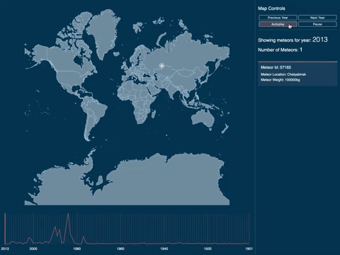

[![npm][npm-image]][npm-url][](https://github.com/prettier/prettier)

# Meteor Map for Meteors from 2013 to 1901

Experimenting with d3 maps and a NASA meteor data set. 
The aim was to create an autoplay meteor visualisation that renders meteors based on their size on the map.

The dataset: https://data.nasa.gov/resource/y77d-th95.json



## Build Commands

Executed from the projects root directory:

```bash

# Build
npm run buid

# Webpack Dev Server
npm run start
```